  

  &nbsp;&nbsp;
  &nbsp;&nbsp;
  

---

### SYS_INFO :: PRIMARY_OPERATOR

> B.Tech Electronics and Communication Engineering (ECE)  
> **Indraprastha Institute of Information Technology, Delhi (IIIT-Delhi)**

Hardware-software co-design, bare-metal computing, and on-device machine learning. Specializing in low-overhead telemetry pipelines, high-performance signal rendering, and real-time execution environments.

---

### CURRENT_RESEARCH

<table>
  <tr>
    <td width="18%" valign="top"><strong>TARGET</strong></td>
    <td width="82%"><strong>Bare-Metal Anomaly Detection</strong> — Advised by Dr. Sujay Deb</td>
  </tr>
  <tr>
    <td valign="top">PIPELINE</td>
    <td>End-to-end LSTM-based sequencing and profiling on the 400K-sample RaDaR dataset. ~0.90 balanced accuracy for real-time anomaly detection.</td>
  </tr>
  <tr>
    <td valign="top">OPTIMIZE</td>
    <td>Minimizing bare-metal execution latency and CPU profiling overhead through feature extraction pipeline tuning.</td>
  </tr>
</table>

 

<table>
  <tr>
    <td width="18%" valign="top"><strong>TARGET</strong></td>
    <td width="82%"><strong>Hardware Security &amp; CPU Telemetry</strong> — HPC-Boost</td>
  </tr>
  <tr>
    <td valign="top">PIPELINE</td>
    <td>Sequential LSTM forecasters and classifiers trained on large-scale CPU performance logs to intercept runtime hardware attacks.</td>
  </tr>
  <tr>
    <td valign="top">OPTIMIZE</td>
    <td>Hybrid feature-selection oracle using XGBoost and Isolation Forest to prune irrelevant telemetry channels.</td>
  </tr>
</table>

---

### SYSTEM_COMPONENTS

<table>
  <tr>
    <td width="22%" valign="top"><strong>LOW_LEVEL</strong></td>
    <td width="78%">   </td>
  </tr>
  <tr>
    <td valign="top"><strong>ML_INFERENCE</strong></td>
    <td>    </td>
  </tr>
  <tr>
    <td valign="top"><strong>UI_RENDERING</strong></td>
    <td>   </td>
  </tr>
  <tr>
    <td valign="top"><strong>TOOLCHAIN</strong></td>
    <td>   </td>
  </tr>
</table>

---

### DEPLOYED_SUBSYSTEMS

<table>
  <tr>
    <td width="25%" valign="top"><strong><a href="https://github.com/breaking-byts/Life-Os">Life-OS</a></strong></td>
    <td width="75%">Privacy-first desktop companion with on-device ML recommendations. Sub-10ms personalization latency via ONNX Runtime inference and LanceDB vector search. Asynchronous IPC pipeline across 80+ Tauri handlers. <em>Tauri · React 19 · ONNX Runtime · LanceDB</em></td>
  </tr>
  <tr>
    <td valign="top"><strong><a href="https://github.com/breaking-byts/Modulation-Studio">Modulation Studio</a></strong></td>
    <td>Framework-free DSP simulator for 8 digital modulation schemes. Constant 60 FPS FFT rendering via custom double-buffered Canvas pipeline with debounced event listeners. <em>TypeScript · HTML5 Canvas · Web Audio</em></td>
  </tr>
  <tr>
    <td valign="top"><strong><a href="https://github.com/breaking-byts/RISC-V-Assembler-and-Simulator">RV32I Sandbox</a></strong></td>
    <td>Two-pass assembler and execution environment for the RISC-V RV32I ISA. Compiler-like parser resolves conditional branches and labels to binary. Visual register-state tracer. <em>Python</em></td>
  </tr>
  <tr>
    <td valign="top"><strong><a href="https://github.com/breaking-byts/AP_Project">University ERP</a></strong></td>
    <td>Multi-tier OOD application across 76 classes (4.5K+ LOC). Dual-database architecture with role-based access control. Thread-safe concurrent data execution validated by JUnit suites. <em>Java · SQLite · JUnit</em></td>
  </tr>
</table>

---

### ANCILLARY_FUNCTIONS

- `photography` — Coordinator at **Tasveer**, The Media Society of IIITD
- `reverse_engineering` — Binary analysis, memory structure traversal, and assembly tracing
- `fitness` — Weight-lifting and cricket
